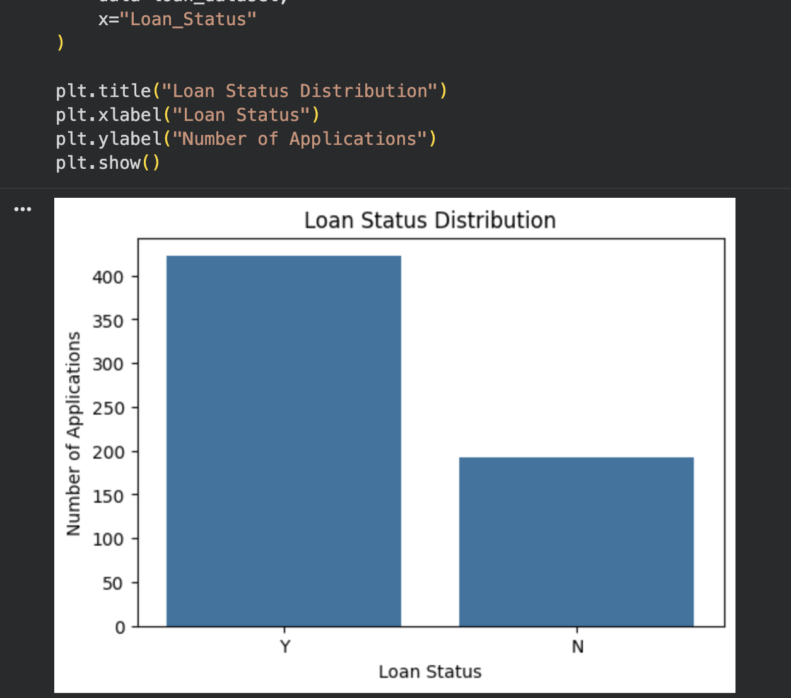
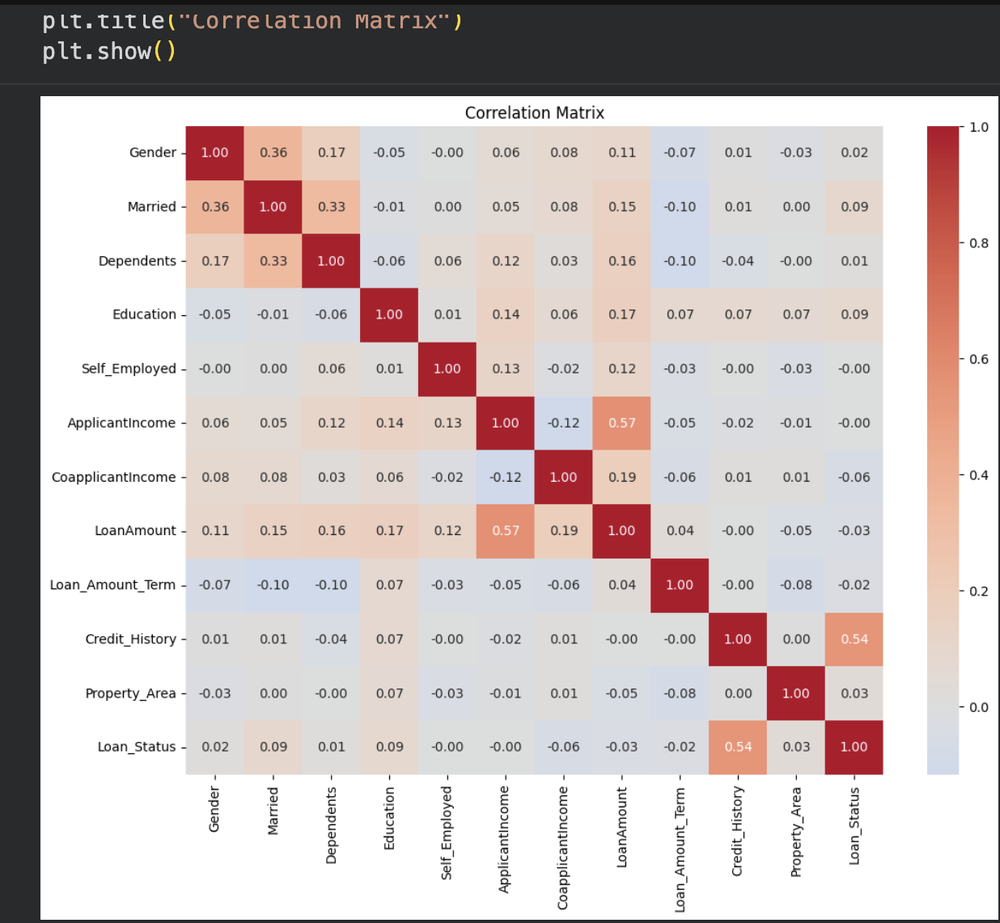
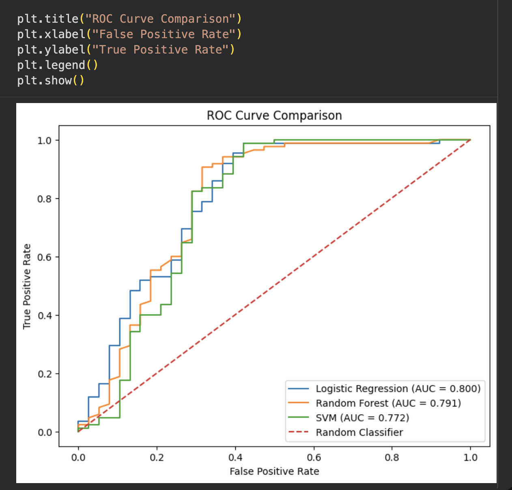
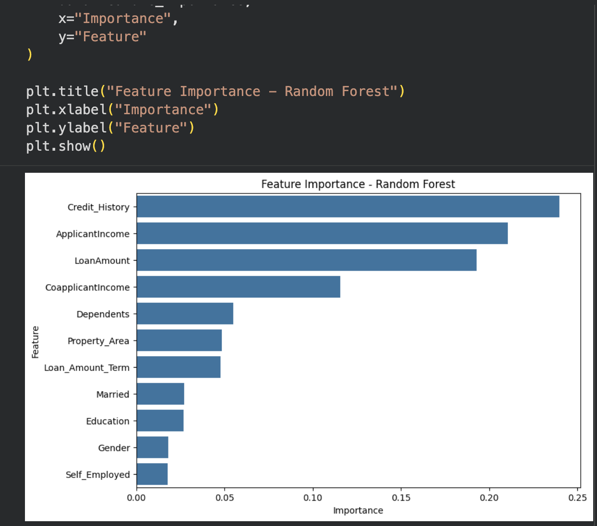
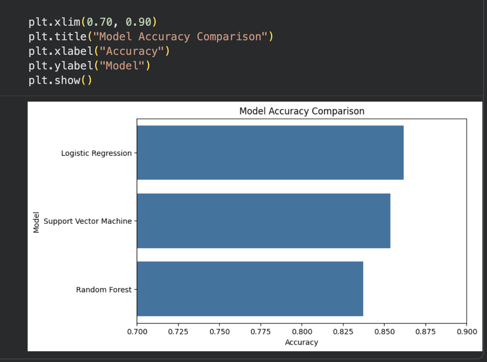

# 🏦 Loan Status Prediction Using Machine Learning

## 📌 Project Overview

This project predicts whether a loan application will be approved or rejected using Machine Learning classification models.

The workflow covers the complete Machine Learning pipeline, including data preprocessing, exploratory data analysis (EDA), feature engineering, model training, and model evaluation.

---

## 📂 Dataset

- **Source:** Loan Prediction Dataset
- **Total Records:** 614
- **Features:** 13
- **Target Variable:** Loan_Status

The dataset contains demographic and financial information about loan applicants.

---

## 🧹 Data Preprocessing

The following preprocessing steps were performed:

- Missing value analysis
- Filled numerical missing values using the **Median**
- Filled categorical missing values using the **Mode**
- Removed the Loan_ID column
- Encoded categorical variables
- Standardized numerical features using StandardScaler

---

## 📊 Exploratory Data Analysis (EDA)

The project includes several visualizations to better understand the dataset.

### Loan Status Distribution



---

### Correlation Matrix



---

## 🤖 Machine Learning Models

The following classification models were trained and evaluated:

- Logistic Regression
- Random Forest Classifier
- Support Vector Machine (SVM)

---

## 📈 Model Performance

| Model | Accuracy | ROC-AUC |
|--------|---------:|--------:|
| Logistic Regression | **86.18%** | **0.7997** |
| Support Vector Machine | **85.37%** | **0.7724** |
| Random Forest | **83.74%** | **0.7910** |

### Best Performing Model

**Logistic Regression** achieved the highest overall performance on the test dataset.

---

## 📉 ROC Curve Comparison



The ROC Curve compares the classification performance of all three models across different decision thresholds.

---

## ⭐ Feature Importance

Random Forest was used to estimate feature importance.



The analysis indicates that variables such as **Credit History**, **Applicant Income**, and **Loan Amount** are among the most influential factors in predicting loan approval.

---

## 📊 Model Comparison



---

## 🛠 Technologies Used

- Python
- Pandas
- NumPy
- Matplotlib
- Seaborn
- Scikit-learn
- Google Colab

---

## 📁 Project Structure

```text
loan-status-prediction/
│
├── data/
│   └── loan_data.csv
│
├── images/
│   ├── loan_status_distribution.png
│   ├── correlation_matrix.png
│   ├── roc_curve.png
│   ├── model_comparison.png
│   └── feature_importance.png
│
├── notebooks/
│   └── loan_status_prediction.ipynb
│
├── requirements.txt
├── .gitignore
└── README.md
```

---

## 🚀 Future Improvements

Future work may include:

- Hyperparameter tuning
- Cross-validation
- XGBoost and LightGBM models
- Model deployment using Flask or Streamlit
- Interactive web application

---

## 👨‍💻 Author

**Mario Jakupas**

Graduate Student in Computer Science

Interested in Data Science, Machine Learning, and Artificial Intelligence.
